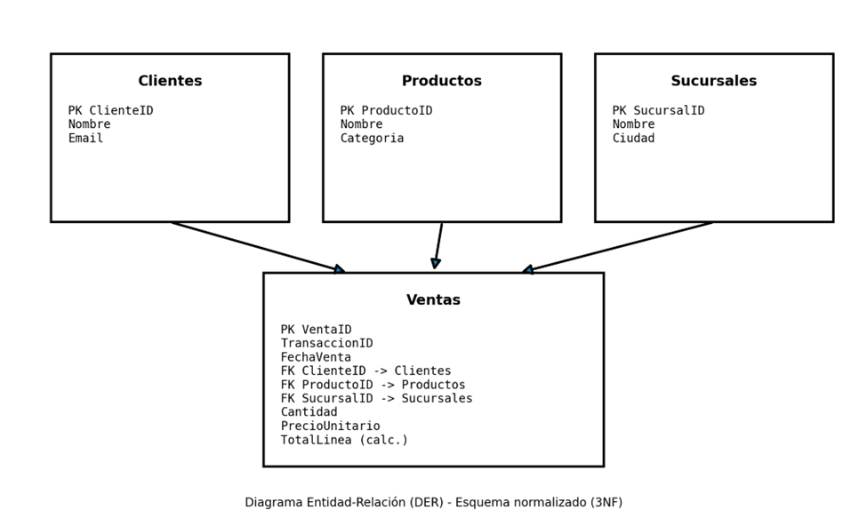
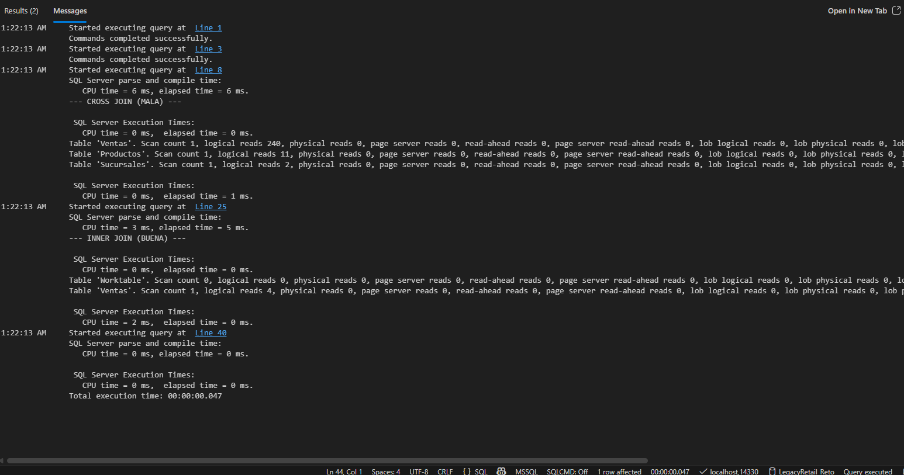

# Reporte Tecnico – Reto SQL Architect & Tuner Protocol

## 1. Contexto y objetivos
LegacyRetail S.A. operó durante años con un archivo plano. La migración directa a una tabla única generó:
- Inconsistencias (duplicidad en clientes/productos)
- Riesgo de performance por consultas con combinaciones masivas (CROSS JOIN)

**Objetivos:**
- Diseñar un esquema relacional 3NF con PK/FK: Clientes, Productos, Sucursales y Ventas.
- Demostrar el impacto del CROSS JOIN con métricas (STATISTICS IO/TIME) y proponer la solución óptima (INNER JOIN).

---

## 2. Diseño relacional (3NF)
**Tablas:**
- `Clientes(ClienteID PK, Nombre, Email)`
- `Productos(ProductoID PK, Nombre, Categoria)`
- `Sucursales(SucursalID PK, Nombre, Ciudad)`
- `Ventas(VentaID PK, TransaccionID, FechaVenta, ClienteID FK, ProductoID FK, SucursalID FK, Cantidad, PrecioUnitario, TotalLinea)`

**Relaciones:**
- `Ventas.ClienteID -> Clientes.ClienteID`
- `Ventas.ProductoID -> Productos.ProductoID`
- `Ventas.SucursalID -> Sucursales.SucursalID`
Figura 1. Diagrama Entidad-Relación (DER)

---

## 3. Auditoría de performance (Tuning)
Se ejecutó la comparativa activando:
- `SET STATISTICS IO ON`
- `SET STATISTICS TIME ON`

### 3.1 Consulta MALA (CROSS JOIN)
Efecto: genera combinaciones Sucursal×Producto incluso cuando no existen ventas.

**Métricas:**
- `Table 'Ventas'... logical reads = 240`

### 3.2 Consulta BUENA (INNER JOIN)
Efecto: opera sobre filas existentes en `Ventas` y une dimensiones con INNER JOIN.

**Métricas:**
- `Table 'Ventas'... logical reads = 4`

### 3.3 Conclusión
El INNER JOIN reduce lecturas lógicas sobre `Ventas` de **240 a 4** (≈ **60×** menos).  
En escenarios grandes, esto evita saturación de CPU/IO y caídas del servicio.

---

## 4. Evidencias

En STATISTICS IO se observa que el CROSS JOIN realiza 240 logical reads en Ventas, mientras que el INNER JOIN realiza 4 logical reads, una mejora aproximada de 60×

